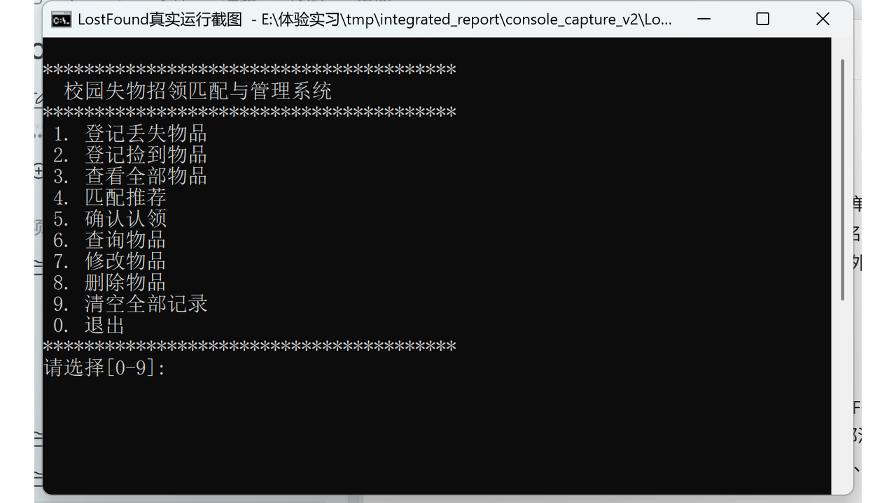
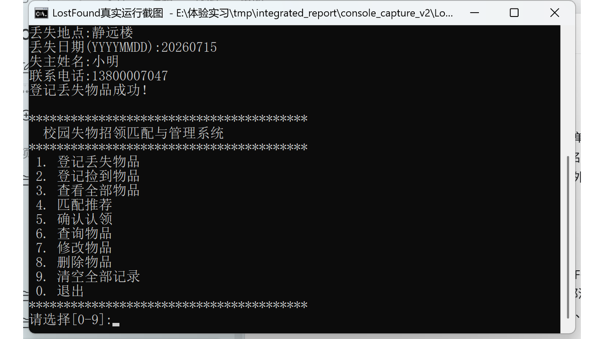
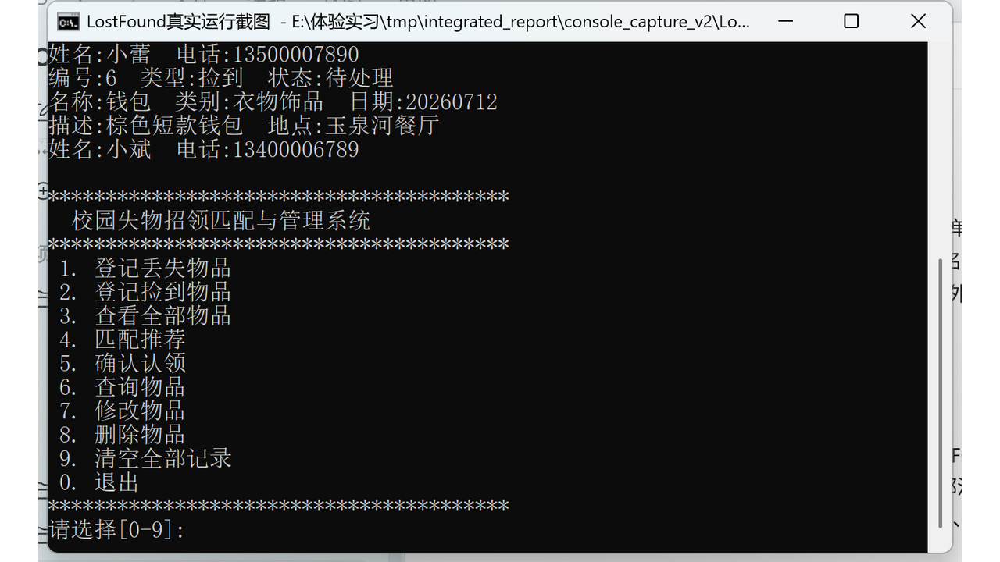
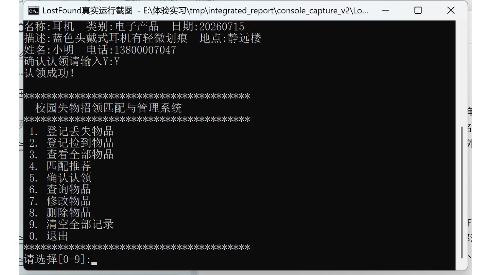
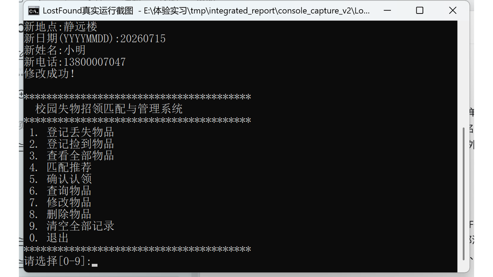
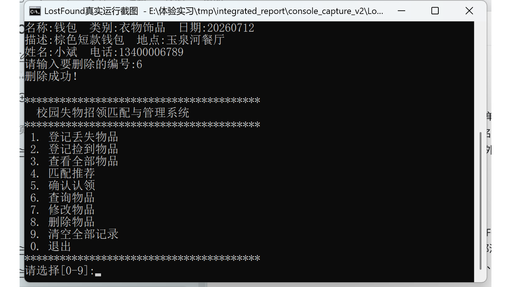
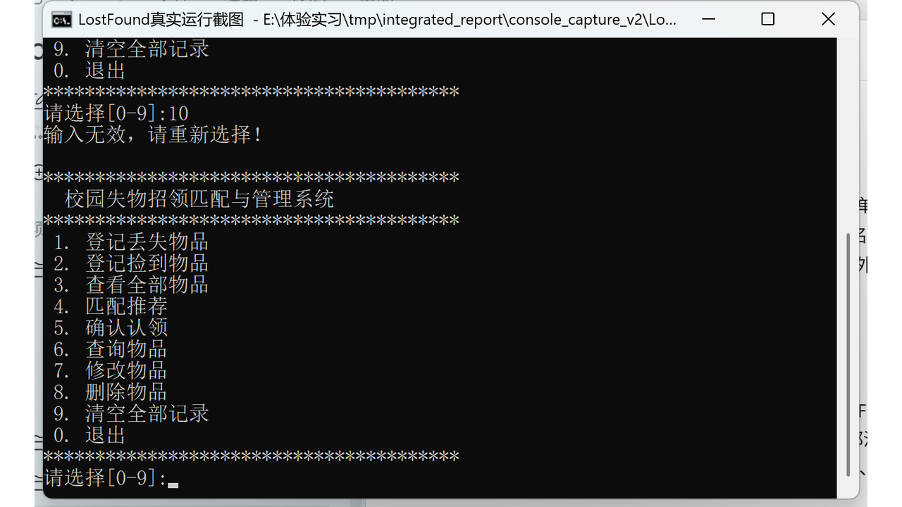
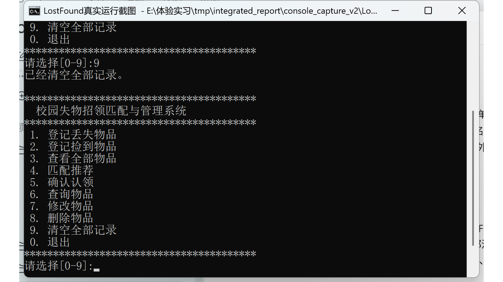

# 校园失物招领匹配与管理系统（控制台版）

> 基于 C++ 控制台实现的失物招领管理系统，提供丢失/捡到物品的登记、查询、修改、删除、匹配推荐与认领处理，并通过文件实现数据持久化。

[](https://isocpp.org/)
[](https://www.microsoft.com/windows)
[](https://visualstudio.microsoft.com/)
[](LICENSE)

---

## 界面预览



---

## 目录

- [1. 项目简介](#1-项目简介)
- [2. 功能特性](#2-功能特性)
- [3. 匹配推荐规则](#3-匹配推荐规则)
- [4. 技术栈](#4-技术栈)
- [5. 项目结构](#5-项目结构)
- [6. 编译与运行](#6-编译与运行)
- [7. 使用说明](#7-使用说明)
- [8. 数据持久化](#8-数据持久化)
- [9. 测试用例](#9-测试用例)
- [10. 许可证](#10-许可证)

---

## 1. 项目简介

本项目是校园失物招领匹配与管理系统（控制台版），面向校园场景设计。它帮助工作人员登记丢失与捡到的物品信息，查看、修改、删除记录，并通过简单的匹配算法为丢失物品推荐可能的捡到物品，最终由人工确认完成认领流程。

系统采用固定数组 + 结构化文件读写实现，不依赖数据库，代码结构清晰，非常适合 C++ 入门学习与课程设计。

## 2. 功能特性

- **登记丢失物品**：记录物品名称、类别、特征描述、丢失地点、日期、失主信息
- **登记捡到物品**：记录上交物品信息，上交人信息可选
- **查看全部物品**：分区展示丢失物品与捡到物品列表
- **查询物品**：按名称或地点关键词进行包含查询，支持返回多条结果
- **修改记录**：修改指定编号的记录的文本信息，保留类型与状态
- **删除记录**：删除指定编号的记录，自动前移后续元素
- **匹配推荐**：为选中的丢失物品推荐可能对应的捡到物品并打分
- **确认认领**：人工核对后完成认领，同步更新双方状态
- **清空记录**：一键清空全部记录并保存
- **数据持久化**：关闭程序后数据仍保留在文件中

## 3. 匹配推荐规则

对选中的丢失物品，程序扫描全部"待处理"的捡到物品，按以下规则计算匹配分：

| 匹配条件 | 加分 |
|---|---|
| 类别相同 | 1 分 |
| 名称相同或互相包含 | +1 分 |
| 地点相同或互相包含 | +1 分 |
| 日期完全相同 | +1 分 |

总分范围为 **0 ~ 4 分**，仅推荐分数达到 2 分的候选。匹配分只用于排序与推荐，不强制作为认领条件：

| 分数 | 含义 |
|---|---|
| 4 分 | 高度推荐 |
| 3 分 | 较高推荐 |
| 2 分 | 可能匹配 |
| 0 ~ 1 分 | 同类别但信息较少，需人工核对 |

## 4. 技术栈

- **语言**：C++（标准 C++）
- **开发环境**：Visual Studio 2019（MSVC v142）
- **平台**：Windows
- **数据存储**：`char[]` + `fstream` 二进制文件读写
- **工程结构**：类封装数据管理（`LostFoundBook`）

## 5. 项目结构

```
LostFound_Console/
├── LostFound.cpp           程序入口、菜单与主流程
├── LostFoundBook.cpp       数据管理类实现（CRUD、匹配、认领、文件读写）
├── LostFoundBook.h         数据管理类声明
├── Item.h                  物品记录结构体定义
├── LostFound.sln           Visual Studio 解决方案
├── LostFound.vcxproj       Visual Studio 项目文件
├── screenshots/            运行截图
├── .gitignore
├── LICENSE
└── README.md
```

## 6. 编译与运行

**环境要求：**
- Windows
- Visual Studio 2019（含 C++ 桌面开发工作负载，MSVC v142 工具集）

**编译运行：**
1. 使用 Visual Studio 2019 打开 `LostFound.sln`
2. 选择 `Debug` 配置与 `x64` 平台
3. 按 `Ctrl+Shift+B` 生成解决方案
4. 按 `Ctrl+F5` 运行程序

## 7. 使用说明

程序启动后显示主菜单，通过输入数字选择功能。

**主菜单：**

```
****************************************
  校园失物招领匹配与管理系统（控制台版）
****************************************
  1. 登记丢失物品
  2. 登记捡到物品
  3. 查看全部物品
  4. 匹配推荐
  5. 确认认领
  6. 查询物品
  7. 修改物品
  8. 删除物品
  9. 清空全部记录
  0. 退出
****************************************
```

**登记物品**

输入名称、类别、特征描述、地点、日期等必填信息，丢失记录还需填写失主姓名与电话。



**查看全部物品**

分区显示丢失物品与捡到物品的完整列表。



**匹配推荐**

选择一条待处理的丢失物品，程序推荐可能匹配的捡到物品并显示匹配分。


**确认认领**

人工核对信息后确认认领，系统同步完成捡到记录与对应丢失记录。



**查询物品**

按名称或地点关键词查询，支持返回多条匹配结果。


**修改与删除**

按列表编号选中记录进行修改或删除。




**非法输入提示**

对各类非法输入（编号越界、日期格式错误、必填为空等）给出友好提示。



**清空记录**

确认后清空全部记录并立即保存。



## 8. 数据持久化

程序将记录以**固定结构体二进制**方式写入 `lostfound_console.dat` 文件：

- 数据文件保存在程序运行目录下
- 关闭并重新打开程序后，记录自动加载恢复
- 加载时逐条读取结构体并校验，避免损坏文件导致数组越界
- 数据文件已被加入 `.gitignore`，不会提交到仓库

## 9. 测试用例

**CRUD 测试：**

- 分别增加一条丢失记录与一条捡到记录
- 修改第一条、中间一条、最后一条记录
- 删除第一条、中间一条、最后一条记录
- 按名称与地点关键词查询多条结果
- 空列表时执行查看、修改、删除、查询、清空
- 添加到 100 条后验证无法继续添加
- 关闭程序再打开，验证数据仍存在

**匹配测试：**

| 丢失记录 | 捡到记录 | 预期匹配 |
|---|---|---|
| 白色耳机 / 电子产品 / 同地点同日 | 白色蓝牙耳机 / 电子产品 / 同地点同日 | 高匹配 |
| 校园卡 / 证件卡片 / 同地点同日 | 校园卡 / 证件卡片 / 同地点同日 | 高匹配 |
| 双肩包 / 衣物饰品 / 不同日期 | 双肩包 / 衣物饰品 / 附近地点不同日 | 可能匹配 |
| 类别不同 | 类别不同 | 不展示 |

**认领测试：**

- 确认认领后，双方记录均显示"已完成"
- 已完成记录不再参与匹配
- 同一条捡到记录不能被重复认领

## 10. 许可证

本项目基于 [MIT License](LICENSE) 开源。
